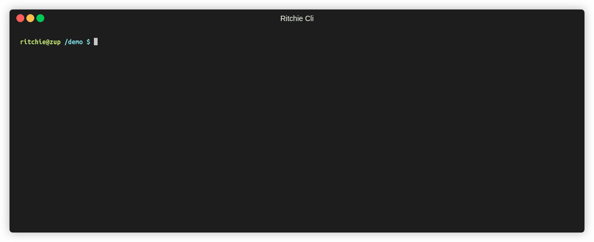

# Description

Remove an item from SQS queue.

The user has to provide 2 inputs:

- Queue URL
- Receipt Handle

## Command

```bash
rit aws delete sqs-item
```

## Demonstration

- Command execution

