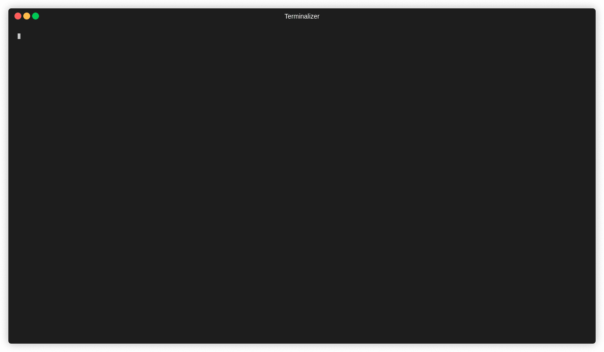

<!-- markdownlint-disable-file MD013 -->
<!-- markdownlint-disable-file MD033 -->

# List Bucket Aws

## Premisses

- [Ritchie installed](https://docs.ritchiecli.io/v/v2.0-pt/getting-started/installation)
- Set AWS credentials (\$ rit set credentials) with ACCESS KEY ID and SECRET ACCESS KEY.

## Command

- Prompt

```bash
rit aws list bucket
```

_It is necessary to have [Golang](https://golang.org/doc/install) installed for this command to work_

- Docker

```bash
rit aws list bucket --docker
```

_It is necessary to have [Docker installed](https://docs.docker.com/get-docker) for this command to work_

- Stdin

```bash
echo '{"region":"sa-east-1"}' | rit aws list bucket --stdin
```

_It is necessary to have [Golang](https://golang.org/doc/install) installed for this command to work_

- Stdin + Docker

```bash
echo '{"region":"sa-east-1"}' | rit aws list bucket --stdin --docker
```

_It is necessary to have [Docker installed](https://docs.docker.com/get-docker) for this command to work_

## Description

This formula will list your buckets on aws providing only one input:

- AWS region i.e., us-east-1, us-west-1, sa-east-1

## Demonstration


