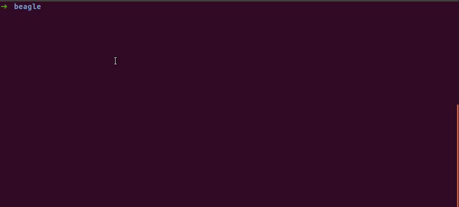

<!-- markdownlint-disable-file MD013 -->
# Ritchie Formula

## command

```bash
rit beagle generate scaffold
```

## description

This formula generates a backend project with beagle and also, if needed, generates a web and/or mobile project with beagle.

## How it works


