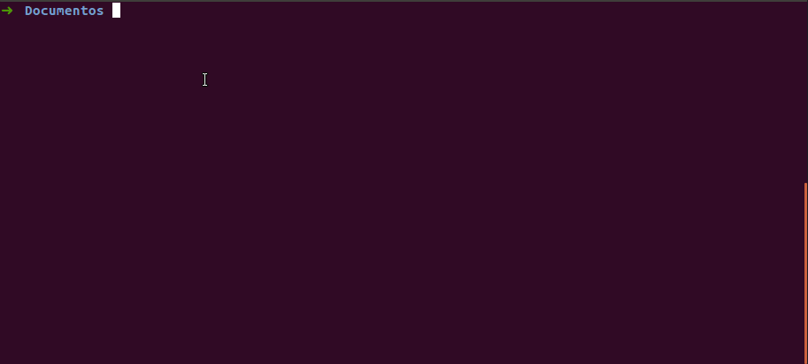

# Create a beagle android template

## Command

### Prompt

`$ rit beagle scaffold android`

### Stdin Unix

`$ echo "{\"project_name\":\"your_project_name\", \"package_name\":\"your_package_name\", \"beagle_version\":\"version\", \"beagle_url\":\"bff_url\", \"min_sdk\":\"min_sdk\", \"target_sdk\":\"target_sdk\"}" | rit beagle scaffold android --stdin`

### Stdin Windows PowerShell

`$ echo "{"project_name":"your_project_name", "package_name":"your_package_name", "beagle_version":"version", "beagle_url":"bff_url", "min_sdk":"min_sdk", "target_sdk":"target_sdk"}" | rit beagle scaffold android --stdin`

## How it works

