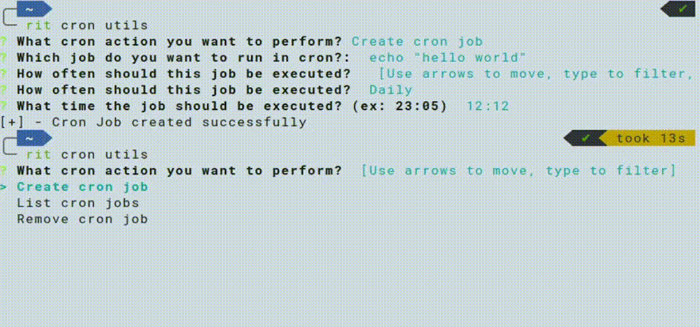

# Description

This Cron Utils command allows the user to schedule, list and remove a cron job.

To shcedule a cron job, a user has to inform:

- The command for execute the job

- The frequency with which this job should be performed

  - Daily
  - Monthly
    - The day of the month
  - Weekly
    - The day of week

- What time the job should be performed

To remove a sceduled job the program will list all scheduled cron jobs ask the user
to select a job to remove.

The list function will simply show all scheduled cron jobs

## Command

```bash
rit cron utils
```

## Requirements

- Python3

## Demonstration

### Create Cron Job


### Unschedule Cron Job


