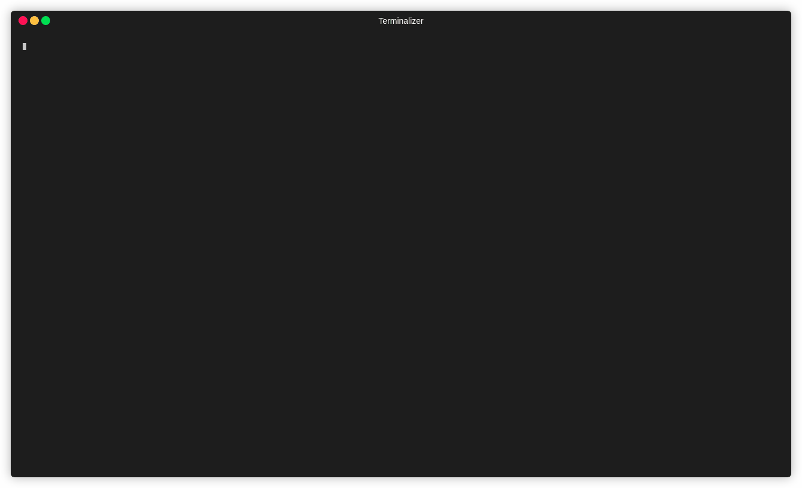

# Generate Compose

## Premisses

- [Ritchie installed](https://docs.ritchiecli.io/v/v2.0-pt/getting-started/installation)

## Command

- Prompt
```bash
rit docker generate compose
```

*It is necessary to have [Golang](https://golang.org/doc/install) installed for this command to work*

- Docker
```bash
rit docker generate compose --docker
```

*It is necessary to have [Docker installed](https://docs.docker.com/get-docker) for this command to work*

## Description

Generate docker-compose.yml in the current directory based on the parameters you choose

## Demo


