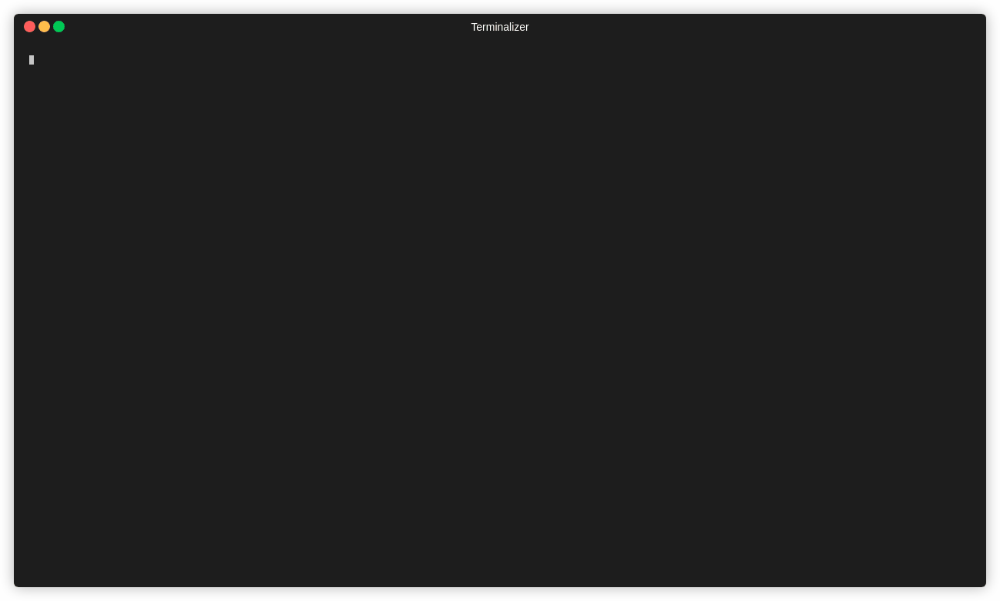

<!-- markdownlint-disable-file MD013 -->
<!-- markdownlint-disable-file MD033 -->

# Description

This formula will list the dependencies of the spring boot starter grouped by type and with the following information:

- Id
- Name
- Description

You can use these ids to generate a scaffold project using spring boot.

## Command

```bash
rit scaffold show spring-starter-dependencies
```

## Requirements

- [Golang Installed](https://golang.org/doc/install)

## Demonstration


